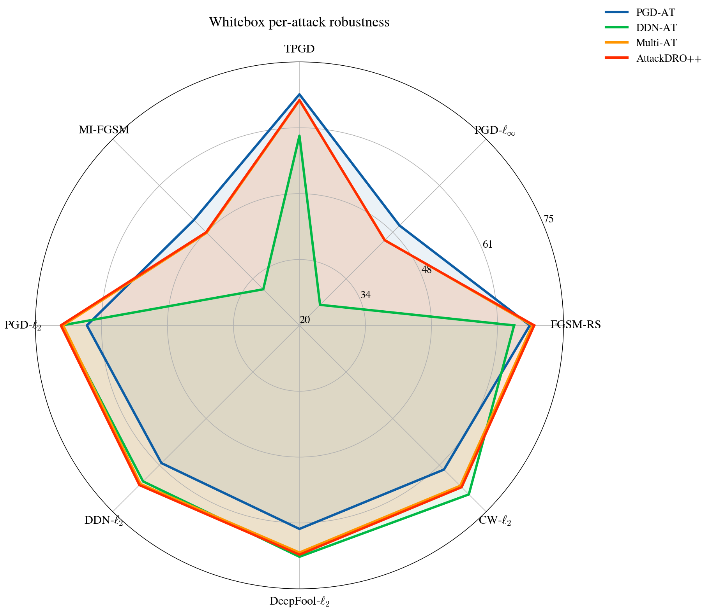

# 01_outline.md — DATN Report Outline

> Governing style source: `06_style_rules.md`
>
> This outline defines the report flow, section purposes, ownership, target length, evidence panels, expected assets, and restructuring plan. It should be updated whenever the chapter/section structure changes.

---

## Narrative spine

The report follows one argument across seven chapters:

```text
1. Adversarial robustness is attack-dependent: a model trained against one threat may fail against another.
2. Treating attacks as domains gives a principled way to study cross-attack robustness.
3. Group-aware training can focus learning on harder attack-induced regions instead of averaging all attacks uniformly.
4. Cluster-based grouping with gradient fingerprints is used to discover hard groups automatically.
5. The proposed method aims to improve average robustness while largely preserving worst-case robustness in the evaluated setting.
6. Graybox evaluation tests whether the observed robustness remains stable when attacks are transferred from surrogate models.
7. Ablations and negative results define which configuration choices matter and what the method still cannot solve.
```

Notes:

- Claims in this outline are intentionally phrased conservatively.
- Strong claims should only be made in the report when supported by final tables/figures.
- If a result is not final, mark its status as `needs check` or `pending`.

---

## Evidence panels

Each results section should draw from a named evidence panel. Do not mix evidence panels in one section without explicitly explaining why.

| Panel | Description | Seeds / Scale | Primary section | Status |
|---|---|---:|---|---|
| A | Paired aggregate whitebox results | n=20 paired seeds | 6.1 | needs source table check |
| B | Per-(class × attack) whitebox analysis | 5 random seeds | 6.2 | available |
| C | Graybox transfer analysis | 5 random seeds; 400 surrogate-target pairs; 32k rows | 6.3 | available |
| D | Hyperparameter sensitivity and ablations | 3 seeds each | 6.4 | needs final table check |

Status options:

```text
final
available
needs source table check
needs final table check
pending
deprecated
```

---

## Target length

Target total: **100–120 pages**.

| Part | Target length | Notes |
|---|---:|---|
| Front matter | 8–12 pages | Cover, declaration, acknowledgement, abstracts, TOC, lists. |
| Chapter 1 — Introduction | 6–8 pages | Compact but not thin; no chapter summary. |
| Chapter 2 — Background | 14–17 pages | Enough detail for attack/DRO foundations; long derivations go to appendix. |
| Chapter 3 — Related Work | 8–10 pages | Should identify the research gap, not only list papers. |
| Chapter 4 — Proposed Methodology | 16–20 pages | Main method chapter; increased detail for core contributions. |
| Chapter 5 — Experimental Setup | 9–11 pages | Reproducibility anchor; includes tools/platforms. |
| Chapter 6 — Results and Analysis | 18–22 pages | Main evidence chapter. |
| Chapter 7 — Conclusion and Future Work | 5–7 pages | RQ answers, limitations, future work. |
| References | 5–8 pages | Target 60–80 references if possible. |
| Appendices | 6–12 pages | Optional: diagnostics, extra matrices, configs, pseudocode. |

---

# Method naming convention

Use these report-facing method names consistently in titles, tables, captions, and prose.

| Old / shorthand name | Final report name | Notes |
|---|---|---|
| PGD-AT | PGD-AT | Single-attack adversarial training using PGD-$\ell_\infty$. |
| DDN-AT | DDN-AT | Single-attack adversarial training using DDN-$\ell_2$. |
| Multi-AT | Multi-AT | Uniform multi-attack adversarial training baseline. |
| AttackDRO++ | AttackDRO++; AttackDRO++ (Ours) in formal result comparisons when needed | Proposed method. Use “the proposed method” when avoiding repeated method names in prose. |

Usage rules:

```text
- Use PGD-AT in formal tables/captions.
- Use DDN-AT in formal tables/captions.
- Use Multi-AT consistently in formal tables/captions.
- Use AttackDRO++ in prose after first definition.
- Use AttackDRO++ (Ours) in formal result tables/captions when comparison clarity is needed.
- Define these names once in Chapter 5 in the compared-methods table.
```

Suggested table label for Chapter 5:

```latex
\label{tab:ch5_compared_methods}
```

---

## Structural rule: no standalone single-child subsection

Do not define a subsection level if it contains only one child.

Bad:

```text
2.2 Adversarial Examples and Threat Models
    2.2.1 Lp-Norm Threat Models and Perturbation Budgets
```

Better options:

```text
Option A — keep only the section:
2.2 Adversarial Examples and Threat Models

Option B — add at least two subsections:
2.2 Adversarial Examples and Threat Models
    2.2.1 Lp-Norm Perturbation Sets
    2.2.2 Whitebox, Graybox, and Blackbox Access
```

Rule:

```text
If a section has subsections, it should have at least two subsections.
If only one subsection is needed, fold it into the parent section.
```

---

## Chapter ownership

| Chapter / Part | Owner | Notes |
|---|---|---|
| Chapter 1 — Introduction | Leader (Kiệt) | Compact motivation and Stage 1 bridge. |
| Chapter 2 — Background | ĐA | Use standardized attack template. |
| Chapter 3 — Related Work | Thành | Focus on positioning and gap. |
| Chapter 4 — Proposed Methodology | Leader (Kiệt) | Main method chapter. |
| Chapter 5 — Experimental Setup | Leader (Kiệt) | Include tools/platforms and attack configuration. |
| Chapter 6 — Results and Analysis | Leader (Kiệt), ĐA for ablations | Main evidence chapter. |
| Chapter 7 — Conclusion and Future Work | Leader (Kiệt) | Final synthesis. |
| Registries/templates | Leader + LLM assistant | Keep synchronized with source files. |

---

# Chapter 1 — Introduction

**Question:** Why does this problem matter, and what does this work do?

**Owner:** Leader (Kiệt)

**Target length:** 6–8 pages.

**Summary rule:** No chapter summary. Ends with report organization.

## Sections

```text
1.1 Adversarial Robustness and the Cross-Attack Gap
1.2 Stage 1 Findings and Their Limitations
1.3 Problem Statement
1.4 Research Questions and Hypotheses
1.5 Contributions of This Work
1.6 Scope and Limitations
1.7 Report Organization
```

| # | Title | Purpose | Target |
|---|---|---|---:|
| 1.1 | Adversarial Robustness and the Cross-Attack Gap | Motivate adversarial robustness and explain why robustness against one attack is not enough. | 500–700 w |
| 1.2 | Stage 1 Findings and Their Limitations | Explain what Stage 1 diagnosed and why Stage 2 needs an intervention, not only evaluation. | 400–550 w |
| 1.3 | Problem Statement | Formalize cross-attack robustness under multi-attack adversarial training. | 250–350 w |
| 1.4 | Research Questions and Hypotheses | State RQs and hypotheses tied to Chapters 5–6. | 300–450 w |
| 1.5 | Contributions of This Work | List method, protocol, and empirical contributions. | 250–350 w |
| 1.6 | Scope and Limitations | Bound dataset, architecture, attacks, and claims. | 200–300 w |
| 1.7 | Report Organization | Explain Chapters 2–7 and why the structure follows the story. | 250–350 w |

### 1.1 Adversarial Robustness and the Cross-Attack Gap

Include:

- Why adversarial robustness matters.
- Models can be robust to one attack but weak against another.
- Cross-attack robustness as the central motivation.
- Keep practical examples brief and avoid overclaiming from CIFAR-10 experiments.

Assets:

| Asset | Status | Notes |
|---|---|---|
| Motivating attack illustration | optional | Use only if available and clean. |

### 1.2 Stage 1 Findings and Their Limitations

Include:

- Stage 1 showed attack-dependent robustness.
- Stage 1 mainly diagnosed the problem.
- Stage 2 proposes a method to reduce the gap.

Assets:

| Asset | Status | Notes |
|---|---|---|
| Stage 1 recap table | needs check | Include only if concise. |

### 1.3 Problem Statement

Include:

- Classification setting.
- Attack-induced domains.
- Domain-specific risk.
- Cross-attack robustness gap.
- Goal under computational constraints.

Equation labels:

- Label only if referenced later.
- Candidate labels should be registered in `03_label_registry.md`.

### 1.4 Research Questions and Hypotheses

Suggested RQs:

| RQ | Question | Evaluated in |
|---|---|---|
| RQ1 | How large is the cross-attack robustness gap under single-attack training? | Ch. 6.1 |
| RQ2 | Does multi-attack training improve robustness across seen and held-out attacks? | Ch. 6.1 |
| RQ3 | Can group-aware training improve robustness and stability beyond uniform multi-attack training? | Ch. 6.1–6.3 |
| RQ4 | Which design choices are responsible for the final behavior? | Ch. 6.4 |

### 1.5 Contributions of This Work

Include:

- Attack-as-domains framing for Stage 2.
- Multi-AT baseline.
- AttackDRO and AttackDRO++.
- Gradient fingerprint clustering.
- Anchor stabilization.
- Multi-seed evaluation and graybox analysis.

### 1.6 Scope and Limitations

Include:

- CIFAR-10.
- ResNet-18.
- PGD-$\ell_\infty$ and DDN-$\ell_2$ as seen attacks.
- AutoAttack-$\ell_\infty$ evaluated across 5 seeds; it is not part of the 20-seed paired aggregate panel.
- No certified robustness.
- No broad architecture/dataset claim. WRN-28-10 experiments exist for Multi-AT and AttackDRO++, but they are treated as supplementary architecture evidence because AttackDRO++ does not outperform Multi-AT in that single observed WRN seed, even though both methods improve over the ResNet-18 setting.

### 1.7 Report Organization

Transition out:

- Report organization itself bridges to Chapter 2.
- Do not add a separate summary.

---

# Chapter 2 — Background

**Question:** What theory and tools does the reader need to understand the method?

**Owner:** ĐA

**Target length:** 14–17 pages.

**Summary rule:** Closing prose paragraph, 100–200 words, ending with a transition to Chapter 3.

## Sections and subsections

```text
2.1 Notation and Learning Setting
    2.1.1 Deep Neural Networks and Supervised Classification
    2.1.2 Loss Functions and Gradient-Based Optimization
2.2 Adversarial Examples and Threat Models
    2.2.1 Lp-Norm Perturbation Sets
    2.2.2 Whitebox, Graybox, and Blackbox Access
2.3 Adversarial Attack Algorithms
    2.3.1 FGSM and Its Random-Start Variant
    2.3.2 Projected Gradient Descent
    2.3.3 Carlini–Wagner Attack
    2.3.4 DeepFool
    2.3.5 Decoupled Direction and Norm
    2.3.6 Momentum Iterative FGSM
    2.3.7 Targeted PGD
    2.3.8 AutoAttack
2.4 Adversarial Training as Min-Max Optimization
2.5 Distributionally Robust Optimization
    2.5.1 From ERM to Worst-Group Risk
    2.5.2 Group DRO Formulation
2.6 Domain Generalization and Clustering
    2.6.1 Domain Generalization: Learning Beyond Known Distributions
    2.6.2 K-Means Clustering for Group Discovery
2.7 Statistical Tools for Multi-Seed Evaluation
    2.7.1 Paired Tests and Bootstrap Confidence Intervals
    2.7.2 Effect Size and Multiple-Comparison Correction
```

| # | Title | Purpose | Target |
|---|---|---|---:|
| 2.1 | Notation and Learning Setting | Define basic supervised learning notation and optimization vocabulary. | 600–800 w |
| 2.2 | Adversarial Examples and Threat Models | Define adversarial examples, perturbation sets, and attacker access assumptions. | 700–900 w |
| 2.3 | Adversarial Attack Algorithms | Explain all attacks used/discussed using the shared attack template. | 1,600–2,200 w |
| 2.4 | Adversarial Training as Min-Max Optimization | Explain standard and multi-attack adversarial training. | 600–800 w |
| 2.5 | Distributionally Robust Optimization | Introduce ERM vs DRO, group DRO, and worst-group risk. | 800–1,100 w |
| 2.6 | Domain Generalization and Clustering | Explain DG and clustering as background for AttackDRO++. | 600–800 w |
| 2.7 | Statistical Tools for Multi-Seed Evaluation | Explain tests and uncertainty reporting used later. | 600–800 w |

Notes:

- Each attack subsection follows `02_writing_templates.md`.
- Long derivations go to appendix.
- Do not preview Chapter 6 results.

---

# Chapter 3 — Related Work

**Question:** What has been tried before, and what gap remains?

**Owner:** Thành

**Target length:** 8–10 pages.

**Summary rule:** Closing prose paragraph, 100–200 words, ending with a transition to Chapter 4.

## Sections

```text
3.1 Multi-Attack Adversarial Training
3.2 Group DRO Applied to Robustness
3.3 Domain Generalization and Adversarial Robustness
3.4 Cluster Discovery in Robust Training Pipelines
3.5 The Remaining Gap and Motivation for This Work
```

| # | Title | Purpose | Target |
|---|---|---|---:|
| 3.1 | Multi-Attack Adversarial Training | Position prior multi-attack methods and their assumptions. | 700–900 w |
| 3.2 | Group DRO Applied to Robustness | Explain how group-aware robustness has been studied and where fixed groups are limited. | 600–800 w |
| 3.3 | Domain Generalization and Adversarial Robustness | Connect DG ideas with adversarial training. | 500–700 w |
| 3.4 | Cluster Discovery in Robust Training Pipelines | Review latent-group and clustering-based methods. | 500–700 w |
| 3.5 | The Remaining Gap and Motivation for This Work | State the gap that Chapter 4 addresses. | 400–550 w |

Notes:

- This chapter should compare and position, not only summarize papers.
- 3.5 should make the proposed method feel necessary.

---

# Chapter 4 — Proposed Methodology

**Question:** What is the proposed method, and why should it work?

**Owner:** Leader (Kiệt)

**Target length:** 16–20 pages.

**Summary rule:** Closing prose paragraph, 100–200 words, ending with a transition to Chapter 5.

## Sections and subsections

```text
4.1 Methodology Overview
4.2 Multi-Attack Training as a Domain Problem
    4.2.1 Setup and Notation
    4.2.2 Multi-Attack Risk and Its Limitations
4.3 Uniform Multi-Attack ERM Baseline
4.4 AttackDRO: Group DRO Over Attack Identities
4.5 AttackDRO++: Group DRO Over Discovered Clusters
4.6 Augmented Clustering with Gradient Fingerprints
4.7 Uniform-Anchored Training Objective
4.8 Complete Training Framework
    4.8.1 Progression from Stage 1 to the Final Method
    4.8.2 Implementation and Computational Considerations
```

| # | Title | Purpose | Target |
|---|---|---|---:|
| 4.1 | Methodology Overview | Roadmap from Stage 1 observation to final method. | 300–450 w |
| 4.2 | Multi-Attack Training as a Domain Problem | Formalize attacks-as-domains and why averaging can hide hard groups. | 700–900 w |
| 4.3 | Uniform Multi-Attack ERM Baseline | Define the strong uniform baseline. | 400–550 w |
| 4.4 | AttackDRO: Group DRO Over Attack Identities | Define attack-level group DRO and its limits. | 700–900 w |
| 4.5 | AttackDRO++: Group DRO Over Discovered Clusters | Explain cluster-based grouping and q-updates. | 900–1,100 w |
| 4.6 | Augmented Clustering with Gradient Fingerprints | Explain feature construction, gradient fingerprints, and random projection. | 800–1,000 w |
| 4.7 | Uniform-Anchored Training Objective | Explain anchor objective and stability motivation. | 700–900 w |
| 4.8 | Complete Training Framework | Put all components together with pseudocode and implementation notes. | 800–1,000 w |

Required assets:

| Asset | Status | Notes |
|---|---|---|
| Algorithm 1 — AttackDRO++ with Gradient Fingerprints and Uniform Anchor | needs check | Main method pseudocode. |
| Table 4.1 — Default hyperparameters for AttackDRO++ | needs check | Should match Chapter 5 setup. |
| Method pipeline figure | optional | Useful if available. |

Notes:

- No results in this chapter.
- Explain mechanism and motivation; empirical validation goes to Chapter 6.
- 4.8 now has two subsections, so it avoids a single-child subsection.

---

# Chapter 5 — Experimental Setup

**Question:** How was the method tested, and under what conditions?

**Owner:** Leader (Kiệt)

**Target length:** 9–11 pages.

**Summary rule:** `\paragraph{Summary.}` with setup recap table (`tab:ch5_setup_summary`), then one transition paragraph to Chapter 6.

## Sections and subsections

```text
5.1 Dataset and Preprocessing
5.2 Model Architecture
5.3 Attack Suite and Configuration
    5.3.1 Training Attacks
    5.3.2 Evaluation Attacks
5.4 Training Configuration
5.5 Hyperparameter Choices and Ablation Factors
5.6 Statistical Significance Protocol
5.7 Evaluation Metrics and Robustness Definitions
5.8 Graybox Transfer Protocol
5.9 Tools, Platforms, and Experiment Tracking
```

| # | Title | Purpose | Target |
|---|---|---|---:|
| 5.1 | Dataset and Preprocessing | CIFAR-10, split, normalization, augmentation. | 200–300 w |
| 5.2 | Model Architecture | ResNet-18 and feature interface. | 200–300 w |
| 5.3 | Attack Suite and Configuration | Training/evaluation attacks and the source-of-truth attack config table. | 700–900 w |
| 5.4 | Training Configuration | Optimizer, LR schedule, epochs, batch size, checkpointing. | 400–550 w |
| 5.5 | Hyperparameter Choices and Ablation Factors | Default configuration and ablation ranges. | 500–700 w |
| 5.6 | Statistical Significance Protocol | Paired tests, bootstrap CI, effect size, Holm-Bonferroni, reporting. | 600–800 w |
| 5.7 | Evaluation Metrics and Robustness Definitions | Mean(8), Worst(8), seen/heldout groups, AutoAttack sanity check. | 500–700 w |
| 5.8 | Graybox Transfer Protocol | Surrogate-target transfer setup, 400 pairs, transfer regimes. | 600–800 w |
| 5.9 | Tools, Platforms, and Experiment Tracking | Colab, Google Drive, W&B, PyTorch, TorchAttacks, AutoAttack, adv-lib, scikit-learn, pandas, matplotlib. | 400–600 w |

Required tables:

| Label | Content | Status |
|---|---|---|
| `tab:ch5_training_attacks` | Training attack configuration | needs check |
| `tab:ch5_attack_configurations` | Full evaluation attack configuration; source of truth for attack naming | needs check |
| `tab:ch5_autoattack_config` | AutoAttack configuration | needs check |
| `tab:ch5_training_config` | General training configuration | needs check |
| `tab:ch5_compared_methods` | Summary of compared training methods | needs check |
| `tab:ch5_attackdro_defaults` | AttackDRO++ default hyperparameters | needs check |
| `tab:ch5_ablation_factors` | Hyperparameters varied in ablation studies | needs check |
| `tab:ch5_reporting_format` | Statistical reporting format | needs check |
| `tab:ch5_eval_metrics` | Summary of evaluation metrics | needs check |
| `tab:ch5_graybox_transfer_regimes` | Transfer regimes | needs check |
| `tab:ch5_tools_platforms` | Tools, platforms, packages, and tracking systems | planned |
| `tab:ch5_setup_summary` | Setup recap table | planned |

Notes for 5.9:

- Mention platforms and tools only as reproducibility context.
- Do not turn 5.9 into a software manual.
- Suggested tools/platforms:
  - Google Colab for experiment execution.
  - Google Drive for checkpoint/result persistence.
  - Weights & Biases (W&B) for experiment logging and run tracking.
  - PyTorch / torchvision for model training.
  - TorchAttacks for most attack implementations.
  - AutoAttack package for AutoAttack-$\ell_\infty$ evaluation.
  - adv-lib for DDN-$\ell_2$ if used.
  - scikit-learn for K-means clustering.
  - pandas / NumPy for analysis.
  - matplotlib for plots.

---

# Chapter 6 — Results and Analysis

**Question:** What did the experiments show, and what does it mean?

**Owner:** Leader (Kiệt), with ĐA contributing ablation analysis.

**Target length:** 18–22 pages.

**Summary rule:** Closing prose paragraph, 100–200 words. No standalone "Main Findings" section.

## Chapter logic

```text
Whitebox aggregate (Panel A)
  → class-wise whitebox drill-down (Panel B)
  → graybox transfer (Panel C)
  → sensitivity to hyperparameters (Panel D)
  → chapter closing synthesis
```

Each section follows:

```text
result → interpretation → limitation → motivation for next section
```

## Sections and subsections

```text
6.1 Whitebox Robustness Under Direct Attacks
    6.1.1 Aggregate Comparison Across Methods
    6.1.2 Per-Attack Accuracy: Where Do Methods Diverge?
    6.1.3 Worst-Case Preservation: AutoAttack and Worst(8)
    6.1.4 Training Stability: How Predictable Is the Outcome?
6.2 Class-wise Whitebox Robustness Across Attacks
    6.2.1 Class-Level Gains and Persistent Difficulties
    6.2.2 Tail-Class Robustness: Do the Weakest Cells Improve?
6.3 Graybox Robustness Across Surrogate Models
    6.3.1 Cross-Method Transfer Structure
    6.3.2 Paired Graybox Comparisons: Does the Whitebox Advantage Carry Over?
    6.3.3 Class-Level Transfer Patterns
6.4 Sensitivity to Key Hyperparameters
    6.4.1 Number of Clusters: How Many Groups Are Needed?
    6.4.2 Anchor Strength: Finding a Stable Trade-off
    6.4.3 Recluster Frequency: How Often Should Groups Update?
```

---

## 6.1 Whitebox Robustness Under Direct Attacks

**Panel:** A

**Status:** needs source table check

**Purpose:** Present aggregate whitebox robustness, per-attack breakdown, worst-case preservation, and variance reduction.

| # | Title | Purpose | Target |
|---|---|---|---:|
| 6.1.1 | Aggregate Comparison Across Methods | Mean(8), seen/heldout splits, method comparison, paired statistical tests. | 400–550 w |
| 6.1.2 | Per-Attack Accuracy: Where Do Methods Diverge? | Per-attack accuracy and attack-family-specific behavior. | 400–550 w |
| 6.1.3 | Worst-Case Preservation: AutoAttack and Worst(8) | Worst(8) and AutoAttack as preservation/sanity checks. | 300–400 w |
| 6.1.4 | Training Stability: How Predictable Is the Outcome? | Seed variance and stability interpretation. | 300–400 w |

Required tables and figures:

| Label | Content | Status |
|---|---|---|
| `tab:ch6_main_aggregate` | Main robustness table, mean ± std | needs source table check |
| `tab:ch6_paired_aggregate` | Paired comparisons: Δ, CI, p-values, effect size, win counts | needs source table check |
| `fig:ch6_per_attack_profile` | Per-attack accuracy profile | needs check |
| `fig:ch6_forest_plot` | Paired-difference forest plot | needs check |

Allowed claim direction:

- Proposed method improves average-case robustness under the evaluated setup if final table confirms.
- Worst-case preservation should be stated conservatively unless strongly supported.
- AutoAttack-$\ell_\infty$ 512 remains a sanity check.

---

## 6.2 Class-wise Whitebox Robustness Across Attacks

**Panel:** B

**Status:** available

**Purpose:** Break down whitebox results by class and attack.

| # | Title | Purpose | Target |
|---|---|---|---:|
| 6.2.1 | Class-Level Gains and Persistent Difficulties | Identify classes that benefit and classes that remain difficult. | 400–550 w |
| 6.2.2 | Tail-Class Robustness: Do the Weakest Cells Improve? | Analyze bottom-K class × attack cells and remaining failure modes. | 300–450 w |

Required tables and figures:

| Label | Content | Status |
|---|---|---|
| `fig:ch6_whitebox_delta_vs_uniform` | Delta heatmap: proposed method vs Uniform | available |
| `fig:ch6_whitebox_delta_vs_pgd` | Delta heatmap: proposed method vs PGD-AT | available |
| `fig:ch6_whitebox_delta_vs_ddn` | Delta heatmap: proposed method vs DDN-AT | available |
| `fig:ch6_whitebox_radar` | Radar chart of per-attack accuracy | available |
| `tab:ch6_whitebox_class_summary` | Class-wise summary statistics | needs check |

Notes:

- Open with seed framing: five random seeds were used for tractability.
- Explain patterns; do not just describe the heatmaps.
- Capacity redistribution and remaining hard classes belong here.

---

## 6.3 Graybox Robustness Across Surrogate Models

**Panel:** C

**Status:** available

**Purpose:** Test whether robustness behavior remains stable under transferred attacks.

| # | Title | Purpose | Target |
|---|---|---|---:|
| 6.3.1 | Cross-Method Transfer Structure | Explain 4×4 method-level transfer matrices. | 400–550 w |
| 6.3.2 | Paired Graybox Comparisons: Does the Whitebox Advantage Carry Over? | Compare proposed method against baselines under graybox transfer. | 400–550 w |
| 6.3.3 | Class-Level Transfer Patterns | Identify class-wise transfer behavior. | 300–450 w |

Required tables and figures:

| Label | Content | Status |
|---|---|---|
| `fig:ch6_transfer_matrix_selected` | Selected transfer matrices for main text | needs selection |
| `tab:ch6_graybox_method_pair_tests` | Aggregate paired graybox tests | available |
| `fig:ch6_graybox_delta_vs_uniform` | Graybox delta heatmap vs Uniform | available |
| `fig:ch6_graybox_delta_vs_pgd` | Graybox delta heatmap vs PGD-AT | available |
| `fig:ch6_graybox_delta_vs_ddn` | Graybox delta heatmap vs DDN-AT | available |
| `fig:ch6_whitebox_graybox_gap` | Whitebox-to-graybox gap comparison | needs check |

Notes:

- Use "five randomly selected seeds" without overexplaining.
- Select only 3–4 representative transfer matrices for the main text.
- Remaining matrices go to Appendix C if kept.

---

## 6.4 Sensitivity to Key Hyperparameters

**Panel:** D

**Status:** needs final table check

**Purpose:** Give practical configuration guidance.

| # | Title | Seeds | Purpose | Target |
|---|---:|---:|---|---:|
| 6.4.1 | Number of Clusters: How Many Groups Are Needed? | 3 | Sensitivity to $K$. | 300–400 w |
| 6.4.2 | Anchor Strength: Finding a Stable Trade-off | 3 | Sensitivity to anchor strength. | 300–400 w |
| 6.4.3 | Recluster Frequency: How Often Should Groups Update? | 3 | Sensitivity to cluster refresh schedule. | 300–400 w |

Required tables and figures:

| Label | Content | Status |
|---|---|---|
| `tab:ch6_ablation_clusters` | Mean(8), Worst(8), and variance across K values | needs final table check |
| `tab:ch6_ablation_anchor` | Mean(8), Worst(8), and variance across anchor strengths | needs final table check |
| `tab:ch6_ablation_recluster` | Mean(8), Worst(8), and variance across refresh schedules | needs final table check |

Notes:

- State once that ablations use three seeds.
- Treat ablations as configuration guidance, not theoretical proof.
- q-frozen and sample-regularizer variants can be moved to appendix if results exist; otherwise remove them.

---

## Chapter 6 closing paragraph

Purpose:

- Synthesize Chapter 6 without adding a new "Main Findings" section.

Content:

1. Average robustness behavior.
2. Worst-case/sanity preservation if supported.
3. Per-class/per-attack patterns.
4. Graybox transfer behavior.
5. Ablation-based configuration guidance.
6. Hand off to Chapter 7.

---

# Chapter 7 — Conclusion and Future Work

**Question:** What was learned, what are the limits, and where does the work lead?

**Owner:** Leader (Kiệt)

**Target length:** 5–7 pages.

**Summary rule:** No separate summary.

## Sections

```text
7.1 Summary of Contributions
7.2 Answers to Research Questions
7.3 Limitations of the Current Study
7.4 Directions for Future Work
7.5 Closing Remarks
```

| # | Title | Purpose | Target |
|---|---|---|---:|
| 7.1 | Summary of Contributions | Restate contributions with evidence. | 400–600 w |
| 7.2 | Answers to Research Questions | Map each RQ to Chapter 6 evidence. | 500–700 w |
| 7.3 | Limitations of the Current Study | State concrete limitations. | 400–550 w |
| 7.4 | Directions for Future Work | Propose extensions tied to observed gaps. | 400–550 w |
| 7.5 | Closing Remarks | End with concise final message. | 100–150 w |

Required assets:

| Asset | Status | Notes |
|---|---|---|
| RQ answer table | planned | Maps RQ, answer, evidence. |

---

# Appendices

Appendices should contain useful details that would distract from the main story.

## Suggested appendices

```text
Appendix A — Pseudocode and Flowcharts
Appendix B — Experimental Logs and Configurations
Appendix C — Additional Tables and Visualizations
```

| Appendix | Content | Status |
|---|---|---|
| A | Additional algorithms, if not included in Chapter 4 | optional |
| B | Full configs, seed lists, compute environment, tool versions | include |
| C | Extra transfer matrices and full per-class tables | optional/include if useful |

Diagnostics decision:

```text
q-trajectory logs, cluster entropy plots, and detailed diagnostic curves are removed from the main report outline.
They should not be included unless the advisor explicitly asks for them later.
```

---

# Front matter

| Component | Status |
|---|---|
| Title page | required |
| Declaration | required |
| Acknowledgement | required |
| Abstract | required |
| Vietnamese summary | recommended/required depending on school format |
| Table of Contents | auto-generated |
| List of Figures | auto-generated |
| List of Tables | auto-generated |
| List of Abbreviations | required because more than ten acronyms are expected |

---

# Cross-reference: old report structure to new outline

| Old structure | New location | Action |
|---|---|---|
| Ch 1 (1.1–1.7) | Ch 1 (1.1–1.7) | Revise titles and compact story. |
| Ch 2 (2.1–2.7) | Ch 2 (2.1–2.7) | Revise titles; ensure no single-child subsections. |
| Ch 3 (3.1–3.5) | Ch 3 (3.1–3.5) | Revise titles and strengthen gap. |
| Ch 4 (4.1–4.9) | Ch 4 (4.1–4.8) | Merge old summary into closing paragraph. |
| Ch 5 (5.1–5.8) | Ch 5 (5.1–5.9) | Add tools/platform section. |
| Old 6.1 Overview of Results | New 6.1 opening prose | Absorb. |
| Old 6.2 Aggregate Robustness | New 6.1.1 | Restructure. |
| Old 6.3 Per-Attack Robustness Profile | New 6.1.2 | Restructure. |
| Old 6.4 Statistical Evidence | New 6.1 | Weave into relevant subsections. |
| Old 6.5 Source and Held-Out Robustness | New 6.1.1 | Merge. |
| Old 6.6 Key Takeaways | Remove | Replace by chapter closing paragraph. |
| Old 6.7 Main Results | New 6.1 | Consolidate. |
| Old 6.8 Graybox Transfer Results | New 6.3 | Restructure. |
| Old 6.9.1 Anchor Strength | New 6.4.2 | Keep. |
| Old 6.9.2 q-Frozen Ablation | Appendix or remove | Keep only if useful/final. |
| Old 6.9.3 Number of Clusters | New 6.4.1 | Keep. |
| Old 6.9.4 Cluster-Refresh Schedule | New 6.4.3 | Keep. |
| Old 6.9.5 Cluster Feature Mode | Appendix or remove | Keep only if useful/final. |
| Old 6.9.6 Sample-Level Regularizer | Appendix or remove | Keep only if useful/final. |
| Old 6.10 Per-(Class × Attack) Whitebox | New 6.2 | Move earlier. |
| Old 6.11 Diagnostics | Appendix C or remove | Do not keep as main section. |
| Old Ch 7 Analysis and Discussion | Remove | Absorb into Chapter 6. |
| Old Ch 8 Conclusion | New Ch 7 | Renumber and revise. |
| Old Appendix A–C | Keep/review | Update content. |

---

# Cross-file dependencies

| File | Depends on | Why |
|---|---|---|
| `03_label_registry.md` | `01_outline.md` | Labels depend on final chapters and sections. |
| `05_notation_registry.md` | `01_outline.md`, `06_style_rules.md` | Notation must support actual sections and style. |
| `04_figure_table_registry.md` | `01_outline.md`, `03_label_registry.md`, `05_notation_registry.md` | Figures/tables need placement, labels, and consistent names. |
| `02_writing_templates.md` | `01_outline.md`, `06_style_rules.md`, `05_notation_registry.md` | Templates should match outline and style. |
| `07_task_assignment.md` | All files above | Tasks depend on outline, assets, templates, and owners. |

---

# Repository figure/table convention

Current intended repository paths:

```text
docs/01_outline.md
report/figures/
```

Because `01_outline.md` is inside `docs/`, figures should be referenced using relative paths such as:

```markdown

```

For planning files, use both:

1. A GitHub Markdown preview image, when the figure already exists.
2. A LaTeX snippet in a fenced code block, so the figure can be copied into the report.

Example figure entry in this outline or in `04_figure_table_registry.md`:

~~~markdown
### Figure: Whitebox per-attack radar

Markdown preview:



LaTeX insertion:

```latex
\begin{figure}[t]
    \centering
    \includegraphics[width=0.95\linewidth]{figures/whitebox/whitebox_radar_per_attack_accuracy_n5.png}
    \caption{Per-attack robust accuracy (\%) under whitebox evaluation, averaged over five seeds. Higher is better.}
    \label{fig:ch6_whitebox_radar}
\end{figure}
```
~~~

Figure sizing guidance:

| Figure type | Recommended width | Notes |
|---|---:|---|
| Single-column simple figure | `0.82\linewidth` | Use for compact plots with readable labels. |
| Main result figure / radar / heatmap | `0.95\linewidth` | Default for most Chapter 6 figures with font size 12. |
| Dense heatmap or matrix | `0.95\linewidth` to `\linewidth` | Use `\linewidth` only when labels or cell values remain hard to read. |
| Two subfigures side by side | `0.48\linewidth` each | Use with subfigure/minipage only when comparison is needed. |
| Full-width figure in two-column-style layout | `\textwidth` | Use only if the template supports it and the figure is important. |

Caption/font guidance:

```latex
% Optional if the document does not already configure caption fonts globally:
\captionsetup{font=small, labelfont=bf}
```

Important note:

```text
Changing \includegraphics width changes the displayed image size, but it does not increase the font size inside raster images such as PNG files.
If axis labels or legends are too small, regenerate the plot with larger matplotlib font sizes rather than relying only on LaTeX scaling.
```

For tables, include:

1. A compact Markdown preview table for planning.
2. A LaTeX table snippet for direct report insertion.

Example table entry:

~~~markdown
### Table: Main aggregate robustness

Markdown preview:

| Method | Mean(8) | Mean $\ell_\infty$ | Mean $\ell_2$ |
|---|---:|---:|---:|
| Multi-AT | TBD | TBD | TBD |
| AttackDRO++ (Ours) | TBD | TBD | TBD |

LaTeX insertion:

```latex
\begin{table}[t]
\centering
\caption{Mean robust accuracy (\%) under the main whitebox evaluation suite. Higher is better.}
\label{tab:ch6_main_aggregate}
\begin{tabular}{lccc}
\toprule
Method & Mean(8) & Mean $\ell_\infty$ & Mean $\ell_2$ \\
\midrule
Multi-AT & TBD & TBD & TBD \\
AttackDRO++ (Ours) & TBD & TBD & TBD \\
\bottomrule
\end{tabular}
\end{table}
```
~~~


Table format guidance:

| Table type | Recommended format | Notes |
|---|---|---|
| Small setup/config table | `tabular` with `booktabs` | Use for Chapter 5 setup tables. |
| Wide result table | `tabularx` or `resizebox{\linewidth}{!}{...}` only if necessary | Prefer readable columns over shrinking text too much. |
| Main result table | `table` + `\centering` + `booktabs` | Bold the best value per metric column. |
| Very dense appendix table | `\scriptsize` or landscape page if needed | Avoid tiny main-text tables. |

Recommended main-text table style:

```latex
\begin{table}[t]
\centering
\caption{Mean robust accuracy (\%) under the main whitebox evaluation suite. Higher is better. The best value per column is bolded.}
\label{tab:ch6_main_aggregate}
\begin{tabular}{lccc}
\toprule
Method & Mean(8) & Mean $\ell_\infty$ & Mean $\ell_2$ \\
\midrule
Multi-AT & TBD & TBD & TBD \\
AttackDRO++ (Ours) & TBD & TBD & TBD \\
\bottomrule
\end{tabular}
\end{table}
```

If the table is too wide, first shorten column names or split the table. Use `\resizebox{\linewidth}{!}{...}` only as a fallback.

Important path rule:

- In Markdown files under `docs/`, preview figures with `../report/figures/...`.
- In LaTeX files compiled from `report/main.tex`, use `figures/...`.
- Keep figure/table source tracking in `04_figure_table_registry.md`; `01_outline.md` should only include representative examples or required asset names.

---
